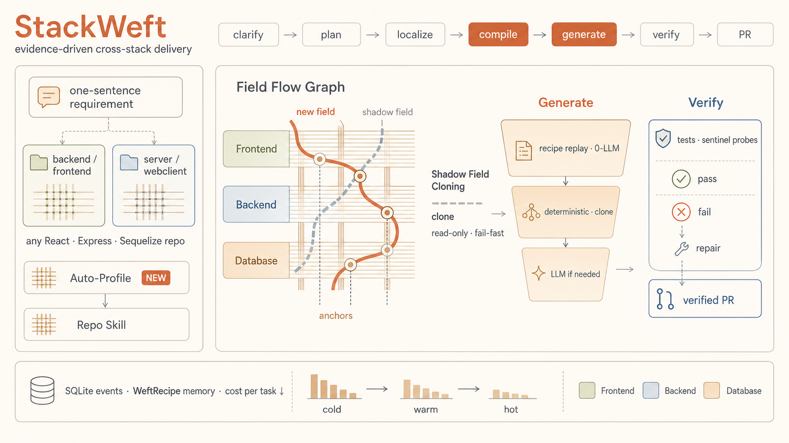

<div align="center">


# StackWeft

**面向全栈交付的"超级个体"** — 用最少token将自然语言需求变成可验证的跨栈变更，落到真实仓库。

`通俗易懂 · 交互直观 · 越用越快 · 越用越省`

<sub>[English](README_en.md) · **中文**</sub>

[](https://www.python.org/)
[](#)
[](#)
[](#生态与接入)
[](LICENSE)


</div>

---

StackWeft 希望打开低 Token 时代的大门。高 Token 时代的狂欢退去，能留下的，是**真正高效，高性价比的工具**，而不是 Token 燃烧机器。

## Why StackWeft

它面向的不只是成熟的全栈开发者，也面向有无限创造力的广大群众——**不做通用编程工具，也不做全功能 Agent 框架，只剑指"全栈项目交付"这一个领域，以最高的性价比，做一个"超级个体"。**

- **对比 Claude Code / Codex**：它们足以完成复杂任务，个体能力足够强大，但交互是 **session 化**的。不人工维护项目记忆，新 session 里哪怕一点小改动也要先大量读代码；复用旧 session，又会把大量平行需求的上下文一起带进来——门槛高、价格高、可复用性差。
- **对比 OpenClaw / Hermes 这类通用全功能 Agent**：把所有任务塞进一个 session，无用上下文不断累积，又难以快速切换 session，虽然具有较强的通用性，但复用能力更差、更贵。
- **StackWeft 的答案**：用户面对的就是一个"**个体**"——只与对话式 Agent 流交互，**没有 session 概念**；既不重复灌冗余 prompt，也不靠人工管记忆，而是用数据库提取历史需求，**找到或创建 skill 来复用高价值工作流**。


## 越用越快、越用越省

- **简单任务工具化**：前端字段添加、前后端字段对应这类**扩充式改动**（如给文章加阅读量、`coverImage` 封面图、评论 `likeCount`、文章 `status` 草稿、`updatedAt` 最后编辑时间），沉淀为**工具化补丁**直接改代码——**0 LLM 调用、0 冗余上下文引入**。
- **复杂前后端功能变化**：把调用链追踪等可复用内容提取为 **skill**，让 AI 越做越快地复用。
- 越用越省 = 同一仓库、同类需求一次比一次便宜；越用越快 = 高价值工作流被沉淀、被复用。

## 无需指定仓库 · 多仓库实时切换

数据库按你自然语言提到的**仓库位置的 hash** 自动确定——不用手填仓库，自然语言提一句即可。支持自然语言**多仓库实时切换**，在同一个对话界面里完成多仓库、多需求的任务。

## 快速开始

```bash
# 一次性安装：建 ~/.stackweft、写 secrets 模板、把 sw 加进 PATH
bash install.sh && source ~/.bashrc
# 然后把模型网关地址 + key 填进 ~/.stackweft/secrets.env

# 默认作用于当前目录所在的仓库（进到目标仓库里直接跑）
cd ~/projects/myapp
sw run "文章详情页想加个副标题，编辑文章的时候能填"

# 说得模糊也没关系——拿不准的地方它会先问你一句，再动手
sw run "给商品加个 SKU 呗"

# 换个仓库：把路径在话里点一下，或用 --repo
sw run "shop 那个项目，给订单加个草稿状态"
sw run "给商品加 SKU" --repo ~/projects/shop

sw json --debug                   # 看最近一次交付的阶段 / token
sw control <run_id> pause|abort|append|resume|confirm   # 运行态人工介入（confirm=确认那个代价大的需求）

node web/server.js                # Web 交互界面 → http://localhost:7878
```

## 目录结构

```
stackweft/   纯 stdlib Python 引擎（core 基础设施 · engine 交付逻辑 · platform 平台 · report 报告）
web/         零依赖 Node 静态服务器 + 单文件 UI 交互界面
skills/      能力库（一类需求一个 .md，可由 AI 起草、版本化、可回滚）
integrations/ 把本项目包装成 skill 供 Claude Code / Codex 当 subagent 调用
assets/      README 素材（图标 / 横幅）
```

## 配置

- 运行 `install.sh` 后，配置与数据都在 `$STACKWEFT_HOME`（默认 `~/.stackweft`）：`secrets.env`（网关地址 + key）、`data/`（SQLite）、`logs/`。
- 模型分层路由，按需取够用最便宜、失败回退；纯 `urllib` 直连网关，无第三方运行期 SDK 依赖。
- 交互语言，默认中文（`STACKWEFT_LANG`）。

## 生态与接入

- 通信接口支持 **OneBot 标准协议**，可接入飞书 / 微信及其它通信软件或嵌入式网页聊天模块。
- 支持 **CLI** 交互，可作为 **subagent** 供其他 Agent 调用——见下。

### 作为 skill 被 Claude Code / Codex 调用

StackWeft 可以打包成一个 **skill**，让宿主 Agent 把「全栈字段/小功能交付」整包委派过来：
宿主只给一句需求，StackWeft 自己编译落点、填槽、跑反例探针、出分支/PR，再把结构化结果交回。
委派契约就两条命令——`sw run "<需求>" [--repo <path>]`（退出码 0=过 / 1=未过）取交付、
`sw json --debug` 取结构化结果。安装说明与现成的 SKILL.md / AGENTS.md 片段见
[`integrations/`](integrations/)。

## 工作原理

把一句需求落到真实的全栈仓库，多阶段流水线、每阶段专职 Agent，难点才升级到泛 agent：



- **compile（核心）**：从一个已存在的"影子字段"定位真实跨栈落点，克隆出新字段在前端 / 后端 / DB 的槽位与锚点，产出一张只读的 **Field Flow Graph**；契约不全则 fail-fast。
- **generate**：逐槽位填，按"已知程度"降级——**工具化补丁 / 历史复用（0-LLM）→ 必要时才 LLM**；每槽用证据当场验收，不符回滚。
- **verify**：跑 Lint + 单测 + **反例 sentinel 探针**（哨兵值必须真流到 DOM / 接口 payload 才算过），不过则定点修复。

全程事件落 SQLite，可暂停 / 恢复 / 打断 / 追加，抗意外终止，重启和恢复。

## 实验结果

**同一个模型（GLM-5.1）、两种方法用同一套工具、同一套打分器**，对比 StackWeft vs Claude Code。跨多个真实全栈仓库、两类实验：

| 实验（均跑 glm-5.1，同打分器） | StackWeft | Claude Code | 省 |
|---|---|---|---|
| 多轮跨栈交付（3 轮，反例探针绿测） | **19,655** tok · 15 调用 · 3/3 ✓ | 309,391 · 53 · 3/3 ✓ | **15.7×** |
| 跨栈字段交付（静态覆盖核验） | **5,578** tok · 3 调用 · 3/3 ✓（热路径） | 158,005 · 9 · 3/3 ✓ | **28×** |

两种方法都把改动跨栈打通、过同一打分器，所以这是**方法论的效率差，不是对错**：Claude Code 也能做对，但长 agentic 上下文 + 每步推理使它又贵又抖（每次最多重读上百 k 输入、抖到 90k–120k/轮）；StackWeft 稳定在几 k/次、个位数调用（compile 只读 grep、generate 一次性填已验证槽位、重复需求走 WeftRecipe 热复用、部分槽 **0-LLM**），公平 LLM 用时也快 ~1.8×。**越用越省**也体现在重复需求上（同类需求冷启 ~40k → 复用配方后 5.6k）。

> *token 用 StackWeft 自带的 per-call 账本，付费 GLM-5.1 官方 API；经**自建网关按独立 key 的用量日志交叉核对，精确到个位**。复现：`python3 bench/run_bench.py --model GLM-5.1`（及 `bench/run_repo_compare.py`），细节与逐项数据见 [`bench/BENCH.md`](bench/BENCH.md)。

其它已核验（DB + git + 重跑测试）：`subtitle`(文本→`<p>`)、`coverImage`(图片→``)、`featured`(布尔→`BOOLEAN`+徽标)、`slug2`(带 DB 索引) 均**0 次返修**；闸门可信——删掉前端接线后同一探针立即 FAIL、还原即过。

### 模型能力测试

主要测试和适配国产主流模型。以下模型均跑通完整交付：

| MiMo-2.5-Pro | DeepSeek-V4-Pro | Kimi-K2.6 | MiniMax-M3 | Qwen3.7-Max | Doubao-Seed-2.0-Lite | GLM-5.1 |
|:---:|:---:|:---:|:---:|:---:|:---:|:---:|
| ✅ | ✅ | ✅ | ✅ | ✅ | ✅ | ✅ |

## 致谢

感谢 **字节跳动** 对本项目的支持。

头像由 **[DiceBear](https://www.dicebear.com/)**(`thumbs` 风格)生成,已离线打包进 `web/assets/avatar.js`。

## License

[MIT](LICENSE) © 2026 Loping151
